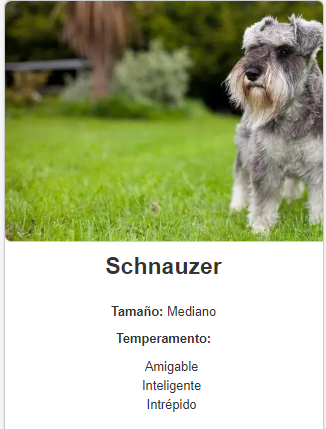
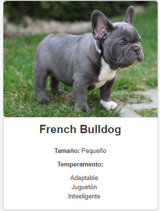

# Catálogo de Razas de Perros

Este proyecto muestra un catálogo de razas de perros utilizando React con TypeScript. Cada raza tiene su propia tarjeta con información detallada como nombre,  tamaño y temperamento.

## Componentes Principales

### DogBreedsList
Renderiza la lista de razas de perros.

### DogBreedCard
 Muestra detalles específicos de cada raza en tarjetas individuales.

### Datos de Razas de Perros

Utiliza un array de objetos para almacenar información detallada sobre diferentes razas de perros, incluyendo propiedades como nombre, tamaño y temperamento.

## Capturas de Pantalla

